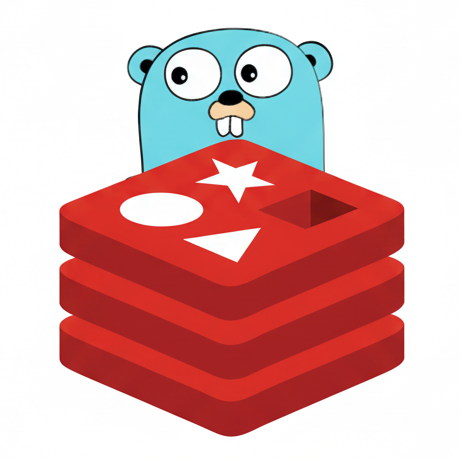

# keel — a Redis-inspired in-memory database in Go

keel is an in-memory key-value database written from scratch in Go. It speaks
**RESP**, the Redis serialization protocol, so `redis-cli` and ordinary Redis
clients talk to it unmodified.

It was called memkv until 2026-09-03. The wire commands `MEMKV.DUMP` and
`MEMKV.RESTORE` are still accepted under their old names, because every
append-only file written before the rename records one — but only `KEEL.*` is
written, and the default log is `./keel-master.aof` with the old name read as a
fallback.

It exists to work out how a high-performance network server actually works:
event loops, socket handling, custom and probabilistic data structures, memory
accounting, eviction, and the low-level decisions underneath a real database.

Every claim below with a number attached was measured rather than assumed —
by a test, or by the harness in [`bench/`](bench/README.md), which keeps the
runs that turned out to be wrong alongside the ones that did not.

The work lives on `develop`. `main` tracks the project this grew out of,
unchanged — see [Where this came from](#where-this-came-from).

## Key features

- **RESP compliant.** Works with `redis-cli` and standard Redis clients.
- **Event loop, not a goroutine per connection.** `epoll` on Linux, `kqueue` on
  macOS, selected by build tag. Per-connection memory stays near zero, which is
  the property [`bench/`](bench/README.md) exists to compare against Go's
  netpoller.
- **Optional multi-threaded I/O.** `-io-threads N` reads sockets, parses RESP
  and writes replies across N threads — worth **1.41x** on 256KB values.
  Command execution deliberately stays on one thread whatever N is, which is
  what lets every store be a plain map with no locking. Off by default, because
  below 64KB the measurements do not justify it.
- **Custom data structures**, implemented from scratch:
  - Skip list, for sorted sets (`ZADD`, `ZRANK`, …)
  - Geohash, for geospatial indexing (`GEOADD`, `GEODIST`, …)
- **Probabilistic data structures:**
  - Scalable Bloom filter — set membership in little memory (`BF.MADD`, `BF.EXISTS`)
  - Count-Min sketch — frequency estimation over a stream (`CMS.INCRBY`, `CMS.QUERY`)
  - HyperLogLog — distinct-element counting in a fixed 12KB, whatever the
    cardinality, within about 0.8% (`PFADD`, `PFCOUNT`, `PFMERGE`)
  - Cuckoo filter — set membership that supports deletion, which a Bloom filter
    cannot, in less space for the same accuracy (`CF.ADD`, `CF.EXISTS`, `CF.DEL`)
  - Morris counter — counting to four billion in a single byte rather than
    four, within 20% (`MORRIS.INCRBY`, `MORRIS.QUERY`)
- **Bounded by memory, not just by key count.** `-maxmemory 512mb` holds the
  keyspace to a byte budget, so the number of keys adapts to how big they are.
  It covers **every** type, not only strings: one 1MB budget holds 1733 string
  keys, or 2826 sets, or 76 HyperLogLogs, and eviction can free a sketch to make
  room for a string. Go gives no way to ask the allocator what a value cost, so
  the accounting is estimated and calibrated against real heap growth — within
  6% for strings and 2.3% for the collection types — with tests comparing the
  estimates against `HeapAlloc` so they cannot drift. The calibration holds
  from **Go 1.22**, which is what `go.mod` requires: on 1.21 the same keys
  hold enough more heap that the estimate falls to 61% of it at small
  values, and a bound enforced against that number stops bounding.
- **One name means one thing.** A key held by one type is refused to every
  other with `WRONGTYPE`, and `DEL` removes whichever type holds it. Resolved by
  asking each keyspace rather than by keeping a directory of names — a directory
  costs a second map entry and a second copy of every key, which measured as the
  memory estimate falling to 70% of real heap.
- **The keyspace commands answer about every type.** `EXISTS`, `TYPE`, `KEYS`,
  `DBSIZE` and `FLUSHDB` ask the same registry that arbitrates names, so a set
  and a HyperLogLog are as much keys as a string is. `DBSIZE` counted only
  strings until these were added, and answered zero for a keyspace full of sets.
  `KEYS` takes Redis's glob patterns, checked case by case against a real Redis
  8.10.1 — including the two places it is not the shell: `[]]` matches nothing,
  and the `-` in `[a-]` is a range end rather than a literal.
- **Active expiry.** A key with a TTL goes away when it falls due, not when
  something next happens to read it. Twenty keys with a TTL are sampled per turn
  of the loop and another round is drawn while the sample keeps coming up
  expired — the same argument the eviction pool makes. Measured: 500 keys given
  a one-second TTL and then left completely alone go from 500 keys and 79,890
  bytes to zero of both, on a server nobody is talking to.
- **Approximate LRU and LFU eviction.** A bounded keyspace: past `-maxkeys`,
  each new key evicts an old one. Rather than ordering every key by access time
  or frequency — which would cost a structure threaded through the keyspace and
  turn reads into writes — both policies sample a few keys at random and evict
  the worst, keeping the best candidates between passes. LRU retains 83% of
  recently-used keys against 49% for random. LFU is the one to reach for when a
  scan would otherwise flush the cache: streaming 2000 read-once keys past a
  1000-key cache leaves LRU holding 1 of its 500 hot keys, and LFU holding 496.
- **Longest common subsequence in linear memory.** `LCS` compares two values the
  way `diff` does. Redis fills an (n+1)(m+1) table to do it, which is 512MB of
  transient allocation for two 11KB values and exactly where Redis gives up.
  Hirschberg's algorithm recovers the same subsequence from two rows instead:
  two 10KB values measured 1.09MB against the 400MB the table alone would have
  been, which turns the limit from a memory one into a time budget you can set.
- **Optional durability.** `-appendonly` logs every write to a file and replays
  it at startup, with `always` / `everysec` / `no` fsync policies. The log
  records what a command *did* rather than what it said: `SPOP` is written as
  the `SREM` it turned out to be, `EXPIRE` as an absolute instant, and evicted
  and expired keys as `DEL` — so a restart reconstructs the keyspace exactly,
  down to identical estimates from the probabilistic types.
- **The log is rewritten before it runs away, without stopping.**
  `BGREWRITEAOF`, or automatically once the file has doubled, replaces the
  history with the shortest log producing the current state — measured, 649KB
  of traffic down to 17KB. The walk runs a slice per event-loop cycle rather
  than all at once: rewriting 400,000 keys, the worst any other client waited
  went from 103.8ms to **9.4ms**.
- **Graceful shutdown.** SIGINT or SIGTERM unwinds the event loop so its deferred
  cleanup actually runs, rather than exiting the process from under it.

## Getting started

```sh
go install github.com/brandopakel/keel/cmd/keel@latest # or run from source, below
keel                                                   # listens on 8081
```

```sh
go run ./cmd/keel                             # replies are coalesced per read (the default)
go run ./cmd/keel -maxkeys 1000000            # bound the keyspace; evicts approximately-LRU
go run ./cmd/keel -maxkeys 1000000 -evict lfu # ...or by frequency, which resists scans
go run ./cmd/keel -maxmemory 512mb            # bound by bytes instead of key count
redis-cli -p 8081                             # from another terminal
```

```sh
go run ./cmd/keel -io-threads 4                   # read, parse and write on 4 threads
go run ./cmd/keel -appendonly                     # survive a restart
go run ./cmd/keel -appendonly -appendfsync always # ...and a power cut
```

Other I/O modes exist for benchmarking; `-mode` selects them and
[`bench/README.md`](bench/README.md) explains what each one is for.

## Correctness and performance

The event loop this inherited answered one command per read and treated every
write as having succeeded. That is invisible against `redis-cli` typing one
command at a time, and comes apart under pipelining or values larger than a
single read. Rewriting that path is most of the work below.

**Correctness**

| | |
| :--- | :--- |
| Partial and pipelined frames | A read is not a message. Bytes are buffered per connection and only whole frames are parsed, so a split command is no longer truncated and a pipelined batch no longer loses every command after the first. |
| Incomplete replies | A short write left a truncated frame on the wire and the client misparsed everything after it; `EAGAIN` on a full send buffer dropped the reply outright. Writes now complete or report why they could not. |
| Frame and buffer bounds | A length header is checked before it is trusted, and unparsed bytes per connection are bounded, so a client cannot open a frame it never finishes and make the server buffer without limit. |
| Spurious readability | `EAGAIN` on a read no longer closes the connection. |
| Per-connection failures | A socket that fails to configure costs that client its connection instead of unwinding the server and disconnecting everyone. |
| Expiry accounting | Giving a key a TTL charges a second map entry, and the charge was made when the object was created — which stopped being before the write that accounted for it. The delete side still gave it back, so `used_memory` counted down past zero and wrapped to 18 exabytes, against which a `-maxmemory` bound would have evicted the entire keyspace on the next write. |
| Expiry table leak | It was keyed by object pointer, and `Put` replaced the object without removing the old one's entry — so every overwrite of a key with a TTL left an entry behind, holding the dead object alive with it. |
| One name, one type | Each type kept its own map, so `SET k v` and `SADD k m` both held `k` at once, both answered, and `DEL k` removed the string and left the set. Every command now resolves a name against all the keyspaces first and answers `WRONGTYPE`, and `DEL` removes whichever type holds the name rather than only a string. |
| `SET` expiry keyword | `SET` read the number after `EX`/`PX` and never the keyword itself, so `PX` set seconds — a thousandfold longer than asked, and silently, since the reply was still `OK`. A keyword that meant nothing at all was accepted just as readily. |
| `SPOP` and `SRAND` | Both indexed the first of a zero-length result, so `SPOP key` with no count **panicked and took the server down**. Asking for more members than the set holds spun the event loop forever, and an empty set panicked a third way. The sampling is now a partial shuffle, which cannot do any of the three. |
| `ZSCORE` | Returned nil for every member that existed and a score of zero for every member that did not — the success test was inverted, for the whole life of the command. |
| Shutdown | The loop is woken and unwound so its deferred `Close` calls run. Previously `os.Exit` skipped them all — the "graceful shutdown" above was not true before this. |

**Performance** — platform is noted per row, because it matters: the Nagle
stall is a Linux delayed-ACK timer and does not reproduce the same way on
darwin. Figures are medians of repeated runs. Method and raw data are in
[`bench/`](bench/README.md).

| | |
| :--- | :--- |
| Nagle vs. delayed ACK *(Linux)* | `TCP_NODELAY` was never set, so a pipelined client was pinned at ~1220 batches/second regardless of batch size — a 40ms delayed-ACK timer, not a throughput limit. |
| Reply coalescing *(Linux)* | Replies from one read are sent as one write instead of one write per command: **4.1x / 8.1x / 13.9x** at pipeline depth 8 / 16 / 64, and 3.0x at P=64 on darwin. Now the default. |
| Large values *(darwin)* | The read path re-copied its buffer on every read, quadratic in value size. Removing that, sizing each read to what the frame still needs, and reading straight into the destination: **11.5x** at 256KB values, 336 → 3866 MB/s. |
| Reply encoding *(darwin)* | Replies were built with `fmt.Sprintf` and then converted, copying every payload twice. Appending instead: **2.7–3.4x** faster encoding, allocations per reply down from 8–9 to 2. |
| I/O threads *(darwin)* | Reads, parsing and writes move off the loop thread with `-io-threads N`, execution staying on one. **1.41x** at 256KB `SET`, saturating at four threads; 11% down in a band around 8KB, and unchanged on a single connection. Off by default. |

## Supported commands

| Category | Commands |
| :--- | :--- |
| **General** | `PING` |
| **String** | `SET`, `GET`, `MSET`, `MGET`, `DEL`, `TTL`, `EXPIRE`, `PEXPIREAT`, `INCR`, `LCS` |
| **Keyspace** | `EXISTS`, `TYPE`, `KEYS`, `DBSIZE`, `FLUSHDB` |
| **Server** | `INFO`, `MEMORY USAGE`, `BGREWRITEAOF`, `KEEL.DUMP`, `KEEL.RESTORE` |
| **Hash** | `HSET`, `HSETNX`, `HGET`, `HMGET`, `HDEL`, `HEXISTS`, `HLEN`, `HKEYS`, `HVALS`, `HGETALL`, `HINCRBY` |
| **Sorted Set**| `ZADD`, `ZRANK`, `ZREM`, `ZSCORE`, `ZCARD` |
| **Set** | `SADD`, `SREM`, `SCARD`, `SMEMBERS`, `SISMEMBER`, `SMISMEMBER`, `SRAND`, `SPOP` |
| **Geospatial** | `GEOADD`, `GEODIST`, `GEOHASH`, `GEOSEARCH`, `GEOPOS` |
| **Bloom Filter**| `BF.RESERVE`, `BF.INFO`, `BF.MADD`, `BF.EXISTS`, `BF.MEXISTS` |
| **Count-Min** | `CMS.INITBYDIM`, `CMS.INITBYPROB`, `CMS.INCRBY`, `CMS.QUERY` |
| **Morris Counter** | `MORRIS.INITBYDIM`, `MORRIS.INITBYPROB`, `MORRIS.INCRBY`, `MORRIS.QUERY`, `MORRIS.INFO` |
| **HyperLogLog** | `PFADD`, `PFCOUNT`, `PFMERGE` |
| **Cuckoo Filter** | `CF.RESERVE`, `CF.ADD`, `CF.ADDNX`, `CF.EXISTS`, `CF.MEXISTS`, `CF.DEL`, `CF.COUNT`, `CF.INFO` |

## Status

keel is a project for understanding how a database server works, and it is
honest about being that rather than something to put real data in. What it does
implement it implements properly: `go-redis` v9 connects to it unmodified,
pipelines, and reads and writes strings, sets and TTLs, and an unsupported
command comes back as an error without dropping the connection. The gaps below
are the ones that decide whether it is usable for anything of yours.

- **Persistence is opt-in.** `-appendonly` makes a restart safe, and the log is
  rewritten before it runs away. Without the flag, a restart is still a flush.
- **`LCS` does not type-check its keys.** Every other command answers
  `WRONGTYPE` for a name held by another type; `LCS` treats such a key as an
  empty string, the same way it treats a missing one.
- **There is no licence**, here or upstream. By default that means nobody has
  permission to use, copy or redistribute it, whatever the code can do. It is
  the first thing to fix if the answer to "can someone else use this" is meant
  to be yes, and because upstream's work is most of what sits underneath, it is
  not a decision this fork can make alone.
- **It is not importable as a library.** `go install
  github.com/brandopakel/keel/cmd/keel@latest` works, but every package lives
  under `internal/`, which Go forbids anything outside this module from
  importing. That is a consequence of it being a server you talk to over a
  socket rather than a package you link against; nothing here is a stable API
  yet, and `internal/` says so rather than implying otherwise.
- **`LCS` does not type-check its keys.** Every other command answers
  `WRONGTYPE` for a name held by another type; `LCS` treats such a key as an
  empty string, the same way it treats a missing one.
- **Seventy-four commands.** No lists, and none of `SCAN`, `MULTI` or pub/sub.
  Hashes are implemented, as are the keyspace commands a client library reaches
  for first — `EXISTS`, `TYPE`, `KEYS`, `MGET`, `MSET`, `FLUSHDB` — which answer
  across every keyspace rather than only strings.
- **One database, no authentication, no TLS, no replication.** `SELECT`, `AUTH`
  and `CONFIG` are unimplemented, and it binds `0.0.0.0` by default. Keep it off
  any interface you do not control.

## Benchmarks

[`bench/`](bench/README.md) holds the harness and every recorded run, including
the wrong ones, with notes on how the harness was mistaken before it was right.
It exists because of [quangh33/memkv#2](https://github.com/quangh33/memkv/issues/2),
which asks whether the hand-rolled event loop should be replaced with Go's `net`
package. The short answer measured here: the netpoller is 8–19% slower for small
values and uses far more memory per connection, while winning at large payloads
and deep pipelining.

## Where this came from

keel began as a fork of [quangh33/memkv](https://github.com/quangh33/memkv),
which is the origin of the server's shape and of the data structures beneath the
network layer: the dictionary, the skip list, the geohash, the Bloom filter and
the Count-Min sketch, and the command surface around them. That design is not
restated here and the credit for it is theirs.

What was added here: the framing and reply-writing rewrite described in
[Correctness and performance](#correctness-and-performance), approximate LRU and
LFU eviction, memory-based bounding across every keyspace, HyperLogLog, the
cuckoo filter, the Morris counter, `LCS`, optional I/O threading, and the
benchmark harness in [`bench/`](bench/README.md).

`main` tracks upstream unchanged, so a diff against it is exactly the work
above. [quangh33/memkv#2](https://github.com/quangh33/memkv/issues/2) is the
upstream discussion the benchmarks were written to answer.

This repository is no longer a GitHub fork of that one — it was detached so it
could stand as its own project. That changes nothing about where the code came
from, and nothing about the licence question in [Status](#status): the work
underneath is still quangh33's, and it is still unlicensed.

## Design log

What each piece does, what it trades away, and the measurement behind the
choice. Read it as the reasoning rather than the changelog.

- **HyperLogLog** — dense encoding, 16384 six-bit registers, Ertl's estimator.
  Estimates track real Redis to within the error bound of both. Redis's
  sparse encoding, which costs a few hundred bytes instead of 12KB for keys
  with few members, is not implemented.
- **Morris counter** — approximate counting in one byte where an exact counter
  needs four. The cell holds an exponent and raises it only with
  probability (1+a)^-c, which makes the estimate ((1+a)^c - 1)/a unbiased
  for any number of increments; a = 0.08 puts eight bits within 3% of the
  range of a Count-Min sketch's 32-bit cell, for 20% relative error per
  counter. Exposed as the cells of a hashed counting table, since that is
  the only place the saving is real — one counter per key would be swamped
  by the ~100 bytes a key costs anyway. Rows are combined by median, not
  the minimum a Count-Min sketch takes: a minimum is right only for exact
  cells, and over noisy ones it finds the unluckiest row rather than the
  cleanest. Measured, the minimum reads 21% low at depth 5 and 26% low at
  depth 9 — worse the more rows are added, which is backwards — while the
  median stays within 2%.
- **Cuckoo filter** — 16-bit fingerprints, four to a bucket, partial-key cuckoo
  hashing. Measured: 96–98% load factor, 16.3–16.7 bits per item at a
  0.009–0.013% false positive rate, against 17.7 bits per item for a Bloom
  filter at a comparable rate — and unlike Bloom it can delete. Fixed
  capacity, so it refuses inserts when full rather than growing.
- **Approx LRU eviction** — five random samples per eviction, with a 16-entry
  pool carried between passes. Measured hot-key retention: 83% against 49%
  for random eviction, where true LRU would score 100%. The pool is worth
  most of that: plain sampling scores 70% at five samples and needs 20 to
  reach 87%. Bounded by key count rather than by memory.
- **Approx LFU eviction** — Redis's logarithmic counter, incremented with
  probability 1/(base*factor+1) so eight bits span millions of accesses, and
  decayed lazily so a key popular yesterday does not outrank one in use
  today. Measured: 99% of a working set survives a 2x scan that leaves LRU
  with 0%, while a working set that moves is still followed. Shares one
  64-bit field with LRU rather than adding its own, which is 76MB at the
  default key limit.
- **Memory-based bounding** — `-maxmemory`, with per-key accounting calibrated
  against real heap growth, reported through `INFO` and `MEMORY USAGE`.
  Covers every keyspace: strings, sets, sorted sets, Bloom and cuckoo
  filters, Count-Min sketches and HyperLogLogs share one budget, and
  eviction chooses between them on a common scale.
- **Longest Common Subsequence** — `LCS key1 key2 [LEN] [IDX] [MINMATCHLEN n]
  [WITHMATCHLEN]`, by Hirschberg's algorithm rather than the table Redis
  builds. Working memory is 16·min(n,m) bytes rather than 4nm: two
  10,000-byte values measured 1.09MB of allocation against a 400MB table.
  What bounds the command is therefore time, not space. It is the only
  command here whose cost is the product of two keys, and on a
  single-threaded server that makes it the only one a client can use to
  stall every other client, so the budget is an operator setting —
  `-lcs-max-cells`, defaulting to where Redis itself stops. Checked against
  a real Redis 8.10.1 over 2008 pairs and again over the wire: the length
  and the returned subsequence agree on every one. The `IDX` ranges are one
  valid decomposition of that same subsequence and can differ, because
  Redis's positions come from walking the table backwards and there is no
  table here.
- **Active expiry** — twenty keys with a TTL sampled per turn of the event
  loop, with another round drawn while more than a quarter of a sample comes
  back expired. Before it, expiry happened only when something read a key, so a
  key written once with an hour's TTL and never read again held its bytes until
  eviction got round to it — which under no memory pressure is never.

  The sample is drawn from the expiry table rather than the keyspace, so a
  server whose keys never expire pays one length check per turn, measured at 2ns.
  The loop is woken at 10Hz to run it, because an idle server is precisely the
  one where unread expired keys pile up and the loop otherwise parks in `epoll`
  until a client turns up.

  Two bugs came out of building it, both from the expiry table having been keyed
  by object pointer rather than by key name. `Put` replaced an object without
  removing the old one's entry, so every overwrite of a key with a TTL leaked an
  entry and kept the dead object alive with it. And nothing could get from an
  expiry back to the name it belonged to, which is exactly what a cycle sampling
  for expired keys needs in order to delete one.

- **Rewriting the log** — `BGREWRITEAOF`, and automatically once the file has
  grown past `-auto-aof-rewrite-percentage` of its size after the last one.
  Without it the log records every write ever made, so it grows with traffic
  rather than with data and startup slows for as long as the server runs. A
  rewrite writes the shortest log producing the current state: one command per
  key, built beside the old file and renamed over it, so a crash leaves one
  whole log or the other and never a half-written one. Measured, 5000 writes to
  one key go from 158,890 bytes to 32.

  Five types have no command that rebuilds them. A HyperLogLog is 12KB of
  registers arrived at by hashing items it deliberately never stored, and the
  same is true of both filters and both sketches — their state is bounded and
  their history is not, so a rewrite unable to write the state would have to
  keep the history for exactly the keys where it grows fastest. They are written
  as bytes through `MEMKV.RESTORE`, which is what that command is for.

  It does not block, and getting there is the interesting part. Redis forks, so
  its child walks a still snapshot while the parent serves; a Go runtime does
  not survive a bare fork. Walking a slice per event-loop cycle instead means
  the keyspace moves underneath the walk — keys written after it passed them,
  created after it would have reached them, deleted before it got there.

  No consistent snapshot is needed to fix that, which is the part worth stating
  plainly. Every key written during a rewrite is remembered, and once the walk
  finishes each is written again from its current state, preceded by a `DEL` so
  the later record replaces the earlier rather than merging with it. Whatever
  the walk saw for those keys is overwritten by what is true at the end, and
  keys nobody touched cannot be stale. The cost is one pass over what changed
  rather than a copy of the keyspace.

  Measured over a million keys: 9ms to collect the names, 488 slices with a
  median of 0.5ms, then 10ms to write what changed and sync. The same work as
  doing it in one go and slightly more of it, with the longest pause down from
  186ms to about 10ms. Over the wire on 400,000 keys, with a second connection
  sending `PING` throughout, the worst it waited fell from 103.8ms to 9.4ms
  while the rewrite itself took a quarter longer.

- **Append-only persistence** — `-appendonly`, replayed at startup, with
  `always` / `everysec` / `no` fsync. The log is flushed and synced between
  executing a cycle's commands and writing its replies, so under `always` a
  client is told its write succeeded only once the record of it is on disk.

  What a command *did* is recorded rather than what it said, because three
  kinds of command do not replay to the same state: `SPOP` removes members
  at random and is written as the `SREM` it turned out to be; `EXPIRE` is
  relative, so it is written as an absolute `PEXPIREAT` — otherwise every
  restart silently renews every TTL and nothing ever expires; and eviction
  and expiry have no command behind them at all, so they are written as
  `DEL`. Replay suspends eviction for the same reason: the log already says
  which keys went, and a replay that also evicted would drop a different
  set on top. A half-written command at the end of the file is the ordinary
  shape of a crash and is dropped with a warning rather than refused.

  Every structure replays to the *identical* state, estimates included,
  because each seeds its randomness per structure from a constant.

- **Threaded socket I/O, in the style of Redis `io-threads`** — `-io-threads N`
  moves the read syscall, RESP parsing and the write syscall onto N threads
  while command execution stays on one, which is what keeps every store an
  unsynchronised map with no locking. A cycle of the loop becomes three
  phases with a barrier between each. Replies are staged in one arena for
  the whole server rather than a buffer per connection, so the
  near-zero per-connection memory that makes the event loop worth having
  survives the change.

  Measured on darwin/arm64, medians of five runs. Three results held
  steady inside the noise floor: **1.41x** at 256KB `SET` (4194 → 5699
  MB/s), saturating at four threads — which is exactly where the motivation
  was, the large-value path one core had become the limit for; **11% down**
  in a band around 8KB, for `GET` and `SET` alike; and no change at all on a
  single connection, which is the threshold declining to split work that
  cannot pay for the split. Small payloads at higher concurrency measured
  1.05–1.25x but with 15–32% spread, so they are recorded rather than
  claimed. Mixed enough to default to off, as Redis does.

  Turning the loop into phases changed the default path too, since
  `-io-threads 1` no longer runs the code every earlier benchmark was taken
  against. Measured rather than assumed, arms alternating rep by rep so each
  pair of readings is a second apart: flat on small values and **10–13%
  faster** at 256KB, which is where reading every ready connection before
  executing any of them has the most to batch. The 256KB rows are also what
  confirms the single-reply bypass survived the rewrite — a large value copied
  through the arena rather than kept by reference would show there, and as a
  loss.

  The 8KB regression is not the handoff: a channel rendezvous measures
  688ns, a fraction of a percent at these rates. Measuring the alternative
  was the more interesting result. Redis busy-waits on an atomic there
  rather than parking a thread; the same spin in Go measures **11.4µs**,
  sixteen times worse than the channel, because goroutines are multiplexed
  onto threads rather than pinned to cores, so a spinning one fights the
  scheduler instead of sidestepping it. Translating that part of Redis's
  design faithfully would have made this slower.

## What's next

Roughly in the order the gaps matter.

**Durability.** A rewrite no longer blocks, but its two ends still do: 8ms to
collect the key names before the walk and 13ms to finish it, per million keys.
Both are one pass over something, and both could be sliced the way the walk now
is. Neither was worth it while the walk was 186ms.

**Command surface.** Lists are the gap now. A list is a new type rather than a
new command — a store, an entry in the type table, memory accounting calibrated
the way the others were, a way for the rewrite to emit it, and a share of the
eviction budget — which is what hashes just cost.

`SCAN` is absent for a reason worth stating rather than leaving as an oversight.
Its guarantee — every key present for the whole iteration is returned at least
once — rests on a cursor over hash buckets that survives resizing. Go's map
gives no such cursor and randomises its iteration order per iteration, so the
only ways to implement `SCAN` here are to snapshot the whole keyspace per cursor,
which costs exactly the per-key memory this server is built to save, or to keep a
second index, which costs it permanently. `KEYS` is implemented and, as in Redis,
walks everything and blocks while it does.

**Operations.** No `AUTH`, no TLS, one database, no replication, and it binds
`0.0.0.0` by default. Anything past a trusted network needs at least the first
two.

**Licence.** There is none, here or upstream, so nobody yet has permission to
use this — see [Status](#status).

**Measurement.** Two numbers are still owed. The small-payload I/O-thread rows
were measured over loopback with the benchmark client sharing twelve cores, and
want a run through `bench/run-offloopback.sh` on Linux before the 7–10% there is
called a property of the design. And the cost of `-appendonly` itself has not
been measured at all — `bench/run-ab.sh` is the right shape for it.
