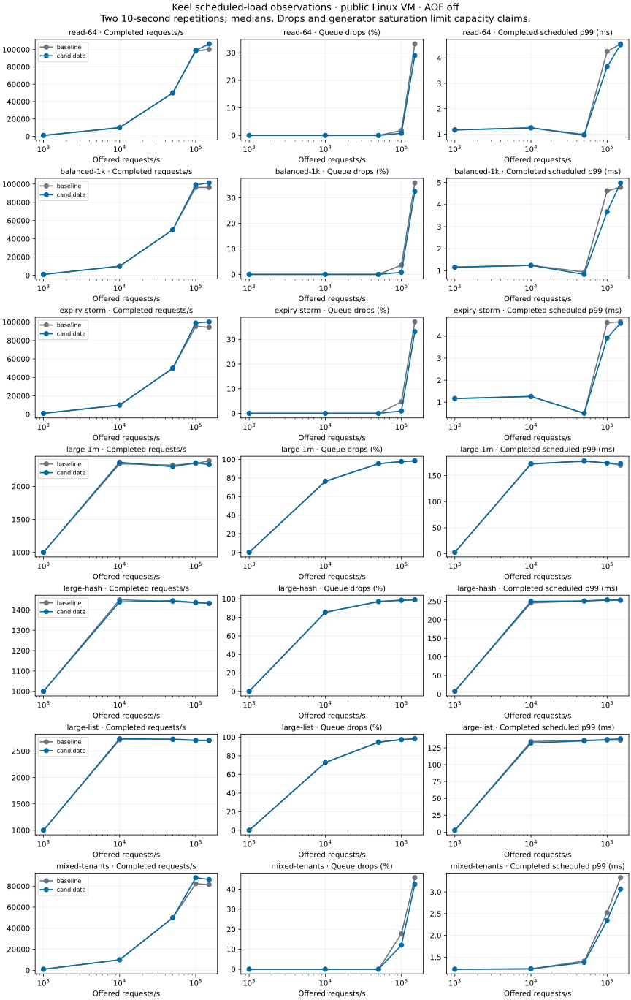

# Scheduled arrivals and larger recovery

`bench/arrival` is an independent Go RESP load generator. It schedules arrivals
without waiting for earlier replies and admits them to a bounded queue feeding
independent connections. It reports scheduled, issued, completed, failed,
queue-dropped and queue-expired counts; every scheduled arrival is accounted for.
Latency from the scheduled arrival includes scheduler and queue delay. Service
latency and scheduler lag are reported separately, along with generator CPU
time. Histogram buckets have at most 1/64 relative width (plus nanosecond
rounding), and the reported quantile is the bucket's upper edge.

Dropped requests are not hidden from throughput or interpreted as server
rejections. A late/saturated generator limits the experiment: inspect generator
CPU, scheduler lag and queue drops before attributing a capacity plateau to
Keel. Failed protocol exchanges fail the harness; expected overload drops remain
recorded measurements. Value correctness is covered separately by the Redis
differential suite. No per-deployment SLO is assumed by this tool.

`bench/run-capacity.py` starts a fresh server for every rate, repetition and arm,
preloads its dataset, then runs the scheduled measurement without a separate
timed warmup. Baseline/candidate order rotates. Both arms use the same AOF policy,
append mode, workload and connection counts. Cases cover small reads, balanced
1 KiB traffic, four rotating whole-second expiry cohorts, 1 MiB values, 4,096-member hashes and
lists, and three tenant mixtures. Tenants have separate generator processes,
connections and queues with a shared scheduled start, avoiding interference
caused solely by one shared generator queue. AOF-off reports append mode disabled.

The smoke run completed all seven cases. A separate four-second expiry case
verified that the expiry counter actually increased. A deliberately slow test
server verifies overload drops and accounting without slowing the arrival
schedule to match completed replies. RESP framing and histogram boundary tests
also pass. Local smoke timings run alongside existing soaks and are not
comparative performance evidence.

`scripts/check-large-recovery.py` verifies two replicas together through
interrupted initial snapshots, a 32 MiB write outage overflowing retained
history, primary rewrite, checkpoint restart without duplicate increments, and
primary crash/epoch recovery. Full dataset digests and the acknowledged counter
are checked after each phase. Catch-up observation times precede digest checks;
phase totals include verification. The local 10 MiB smoke passes all phases.
The combined candidate 27cd4ad also passed all phases with 128 MiB and two
replicas in [34105832356](https://github.com/brandopakel/keel/actions/runs/34105832356).
Initial catch-up was observed at 2.52/2.67 seconds, history-overrun recovery at
2.46/2.71 seconds, checkpoint restart at 0.33/0.33 seconds (471/255 transferred
bytes), and primary-epoch recovery at 3.13/3.47 seconds. Both replicas preserved
the full digests and all 513 acknowledged increments. These are observations
on one public runner, not recovery-time guarantees. The full report and exact
build provenance are in `bench/results/larger-recovery-2026-09-07.json`.
The default hosted dataset is 128 MiB, with both replicas independently verified.

The manual `capacity-validation.yml` workflow builds exact candidate/baseline
runtime commits with Go 1.27.1 and records generator/runtime provenance. It uses
standard free Linux runners and disjoint exposed physical-core groups. The
larger recovery test runs on another standard runner. These are public-VM
measurements; dedicated deployment hosts, underlying tenancy and deployment
latency guarantees remain outside their evidence.

Example local smoke (owned disposable servers only):

```sh
go build -o /tmp/keel-arrival ./bench/arrival
go build -o /tmp/keel-candidate ./cmd/keel
python3 bench/run-capacity.py --candidate /tmp/keel-candidate --load /tmp/keel-arrival --out dist/capacity-smoke --rates 1000 --seconds 1 --reps 1
python3 scripts/check-large-recovery.py --bin /tmp/keel-candidate --out dist/recovery-smoke --keys 160
```

The first capacity dispatch stopped before measurements because the race test
inherited CGO_ENABLED=0; the workflow now explicitly enables cgo for that test.
The second dispatch reached the expiry workload and its assertion correctly
failed: at 10,000 requests/second, writes refreshed the same keys before their
TTLs elapsed. Its partial samples are retained in
`bench/results/capacity-first-sweep-2026-09-07.json.gz` and are not pooled with
corrected measurements. Four rotating namespaces now reuse a key only after
its cohort deadline. A mixed deterministic key index also prevents read/write
choice from partitioning the keyspace into disjoint keys. The corrected local
four-second expiry checks passed at 1,000, 10,000 and 100,000 offered requests
per second, with observed expirations at every rate. Timing remains smoke-only.

The corrected sweep completed all 140 arms in
[34108229947](https://github.com/brandopakel/keel/actions/runs/34108229947):
seven workloads, five offered rates, two arms and two ten-second repetitions.
All requests are accounted for and there were no protocol failures. Every expiry
arm observed expirations. Full samples and provenance are retained in
`bench/results/capacity-corrected-2026-09-07.json.gz`;
[the complete table](capacity-sweep-2026-09-07.md) includes drops, scheduled/service
latencies and generator CPU for every rate, rather than reporting only successful
requests. The runtime comparison is combined candidate 27cd4ad against merged
traversal baseline 9f15587, with AOF disabled in both. It does not isolate a
single optimization and predates later collection admission and client fairness.

Small read, balanced and expiry cases delivered all 50,000 offered requests/s
in both arms. At 100,000 offered/s, candidate medians completed about
99,000/s with 0.8–1.0% queue drops, versus 95,000–98,000/s and 1.8–4.7% for
baseline. At 150,000 offered/s, substantial drops remain (candidate 29–33%).
These are observed load curves, not lossless capacity or deployment SLOs.
At low rates the generator's approximately 1 ms scheduling delay dominates
scheduled p99 even though small-command service p99 is around 0.11–0.20 ms.

The 1 MiB case completes about 2,300–2,400/s once overloaded, with over 76%
drops at 10,000 offered/s. Large hash/list plateaus cannot establish server
capacity: their generator consumes approximately both assigned cores, and
scheduler p99 grows to roughly 19–30 ms. The tenant mixture also approaches
the generator CPU budget at high rates. Stronger generator parsing/sharding
or additional suitable free host capacity is needed before attributing those
plateaus to Keel. Completed-request p99 alone understates overload severity.

The generator's collection-discard path reproduced 8,192 allocations and about
197 KiB of allocation per 8,192-element response. `bufio.Reader.Discard` now
skips bounded bulk payloads in place, preserving framing checks. The same local
parser benchmark allocates zero bytes and zero objects; its timing is diagnostic
only. Framing, truncation, nesting and overload tests, race and vet pass. Raw
before/after results are in `bench/results/arrival-discard-2026-09-07.txt`.
A new targeted hosted sweep is required before using this generator to revise
the large-collection capacity observations; old and new samples stay separate.


